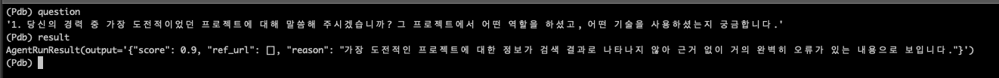
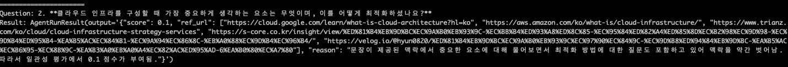
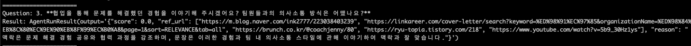
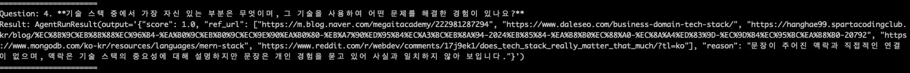
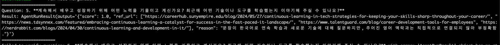

# 채용 인터뷰 질문 생성 에이전트

## Setup

```bash
pip install -r requirements.txt
```

## Run

```
export OPENAI_API_KEY=<openai-api-key>
export TAVILY_API_KEY=<tavily-api-key>
```

```python
python interview_simulator.py --resume <path/to/resume.pdf> --job <job.url>
```

## Result

See [result/](result/) for internal documentation and agent architecture details.






