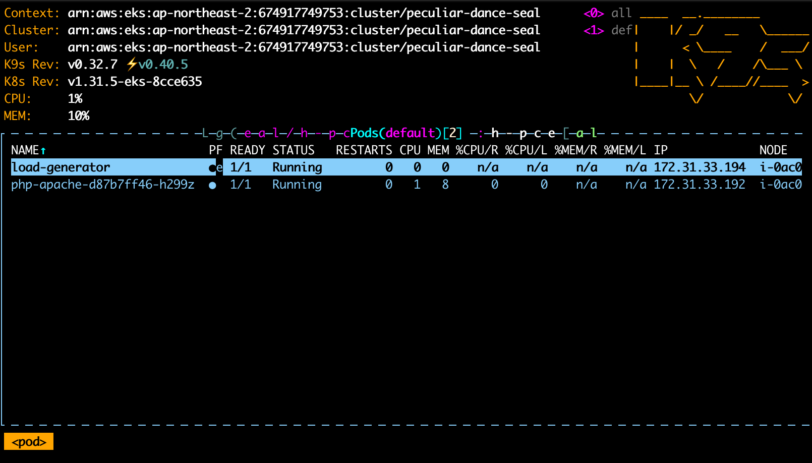
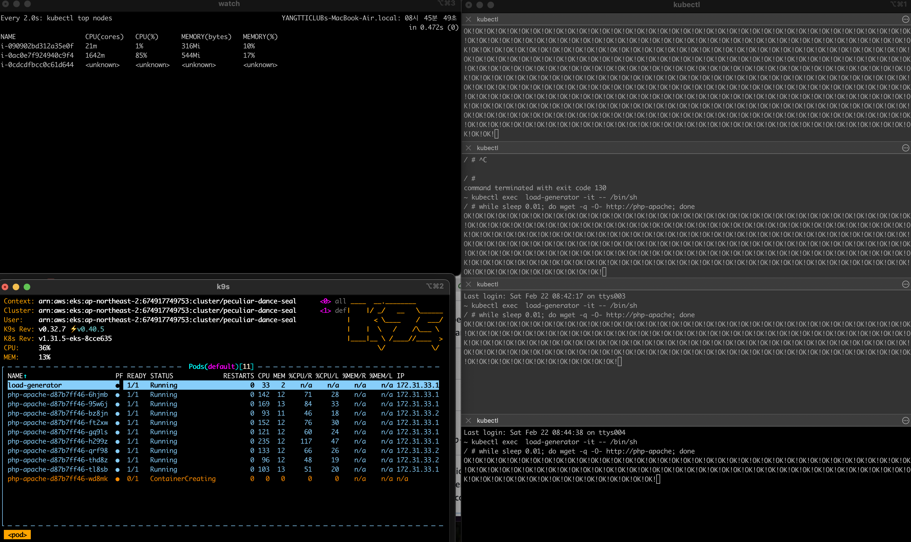
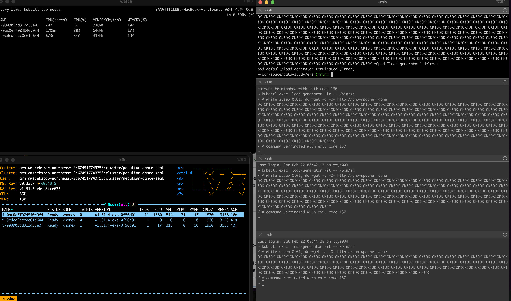

# Dependencies
- [awscli](https://docs.aws.amazon.com/cli/latest/userguide/getting-started-install.html)
- [kubectl](https://kubernetes.io/docs/tasks/tools/install-kubectl-windows/)
- [k9s](https://k9scli.io/) (optional)

# References
- https://docs.aws.amazon.com/eks/latest/userguide/create-kubeconfig.html
- https://docs.aws.amazon.com/eks/latest/userguide/horizontal-pod-autoscaler.html

## 1. Launch cluster at AWS

## 2. Update kube config
```bash
aws eks update-kubeconfig --region ap-northeast-2 --name my-cluster
kubectl cluster-info
```

## 3. Deploy apache web server
```bash 
kubectl apply -f https://k8s.io/examples/application/php-apache.yaml
```

## 4. Autoscale deployment
```bash
kubectl autoscale deployment php-apache --cpu-percent=50 --min=1 --max=10
kubectl get hpa
```

## Run stress test
```bash
kubectl run -i \
    --tty load-generator \
    --rm --image=busybox \
    --restart=Never \
    -- /bin/sh -c "while sleep 0.01; do wget -q -O- http://php-apache; done"
```

## Clean up
```
kubectl delete deployment.apps/php-apache service/php-apache horizontalpodautoscaler.autoscaling/php-apache
```


## Screenshots







