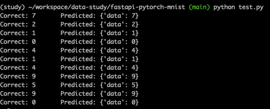
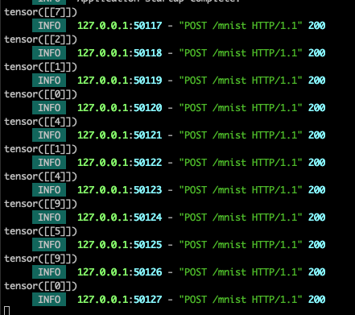

# fastapi-pytorch-mnist
Run FastAPI server with pytorch model for mnist dataset

endpoint is http://localhost:8000/mnist

## Prerequisite
- REST API

## Development

1. make and source virtualenv

```bash
python3 -m venv ~/.venv/app
```

2. Install [FastAPI](https://fastapi.tiangolo.com/#alternative-api-docs)

```bash
pip install "fastapi[standard]"
fastapi dev main.py
```

3. Install torch torchvision

```bash
pip install torch torchvision
```

4. Train [pytorch/examples/mnist](https://github.com/pytorch/examples/blob/main/mnist/main.py)

5. Add a POST request handler where input is an array of integers(mnist image) and output is predicted value

6. Run server

## Test

0. Install dependencies
```bash
pip install -r requirements.txt
```

1. Build model
```bash
python mnist.py --save-model
```

2. Run server
```bash
fastapi dev main.py
docker run -p 8080:80 fastapi-pytorch-mnist
```

3. Run test script
```bash
python test.py
```

## Output

### Test 0utput


### Server log



## 2025.02.15
### Run HPA
```
kubectl apply -f nginx-deployment.yaml
kubectl expose deployment nginx-deployment --type=ClusterIP --name=nginx-service
kubectl autoscale deployment nginx-deployment --cpu-percent=40 --min=1 --max=10
kubectl get hpa
kubectl run -i --tty load-generator --image=busybox -- /bin/sh
while true; do wget -q -O- http://nginx-service.default.svc.cluster.local; done
kubectl run stress --image=alpine -- sh -c "apk add --no-cache stress && stress --cpu 4 --timeout 600s"
kubectl exec  load-generator -it -- /bin/sh

kubectl apply -f https://github.com/kubernetes-sigs/metrics-server/releases/latest/download/components.yaml
kubectl get deployment metrics-server -n kube-system
kubectl describe deployment metrics-server -n kube-system
kubectl top pods
kubectl top nodes
```
