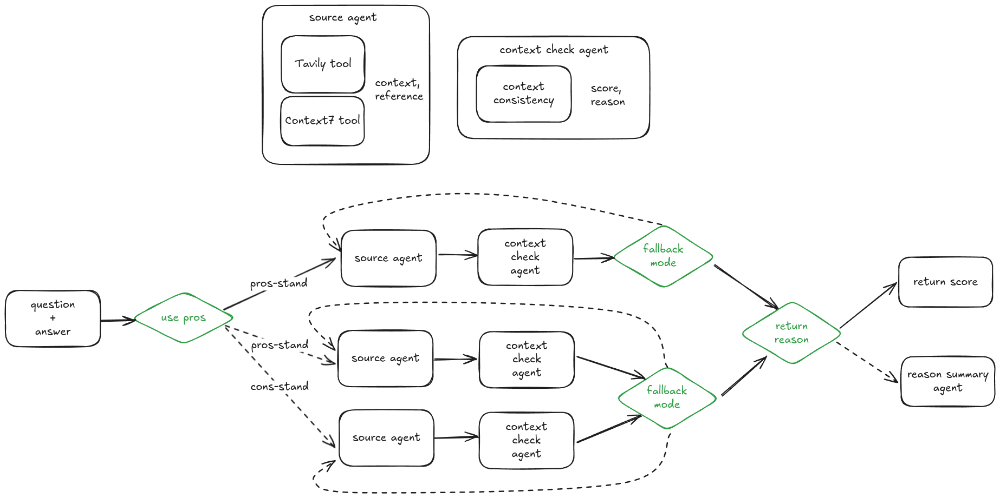

# Halucination Check Agent



- LLM 응답 내 할루시네이션(사실과 다른 정보)과 자기모순 여부를 검출하는 평가 에이전트입니다.
- **Context7** 툴은 구현되지 않았습니다.

## 📚 Reference

* [SelfCheckAgent(25.02)](https://arxiv.org/html/2502.01812v1)
* [SelfCheckGPT(23.10)](https://github.com/potsawee/selfcheckgpt)
* [NLI 기반 문장 자기모순 및 할루시네이션 평가 방법 요약](assets/what_is_nli.md)

## 고민 및 설계 결정

### 긴 문장도 가능한가?

* 예제는 대부분 짧지만, 대표적인 할루시네이션 벤치마크 데이터셋([wiki\_bio\_gpt3\_hallucination](https://huggingface.co/datasets/potsawee/wiki_bio_gpt3_hallucination))의 Ground Truth는 상당히 긴 문장도 포함.
* 따라서 긴 문장에 대해서도 평가가 가능하다고 생각.

### NLI vs Ngram vs LLM-API

* **LLM-API 기반**은 속도는 느리지만 성능이 가장 우수하고, 왜 그런 평가를 내렸는지에 대한 추가적인 reasoning 정보도 함께 제공 가능.
* 단, LLM 호출 실패(fallback) 가능성은 존재.
* **속도가 중요하거나 도메인 특화** 환경이라면 작은 NLI 모델을 튜닝해서 사용하는 방식도 고려 가능.

---

## 💻 How to Run

### 1. 클론 및 의존성 설치

```bash
git clone https://github.com/middlek/halucination_check_agent.git
cd halucination_check_agent
uv venv
source .venv/bin/activate
uv sync
```

### 2. Langfuse 실행

```bash
cd langfuse
docker compose up -d
```

Langfuse가 `http://localhost:3000`에서 실행됩니다. 로그인 후 프로젝트 생성 및 API 키 발급.

### 3. 환경변수 설정

`.env` 파일 생성 후 다음 내용을 채워주세요.

```env
OPENAI_API_KEY=
LANGFUSE_SECRET_KEY=
LANGFUSE_PUBLIC_KEY=
LANGFUSE_HOST=http://localhost:3000
TAVILY_API_KEY=
```

### 4. 실행

#### 단일 디버깅용 실행:

```bash
uv run src/graph.py
```

#### Agent-to-Agent 프로토콜 서버 실행:

```bash
uv run uvicorn a2a:app --host 0.0.0.0 --port 8000 --app-dir src
```

- Demo 접속: 브라우저에서 `http://localhost:8000/docs`에 접속하면 데모 테스트 가능합니다.

---
